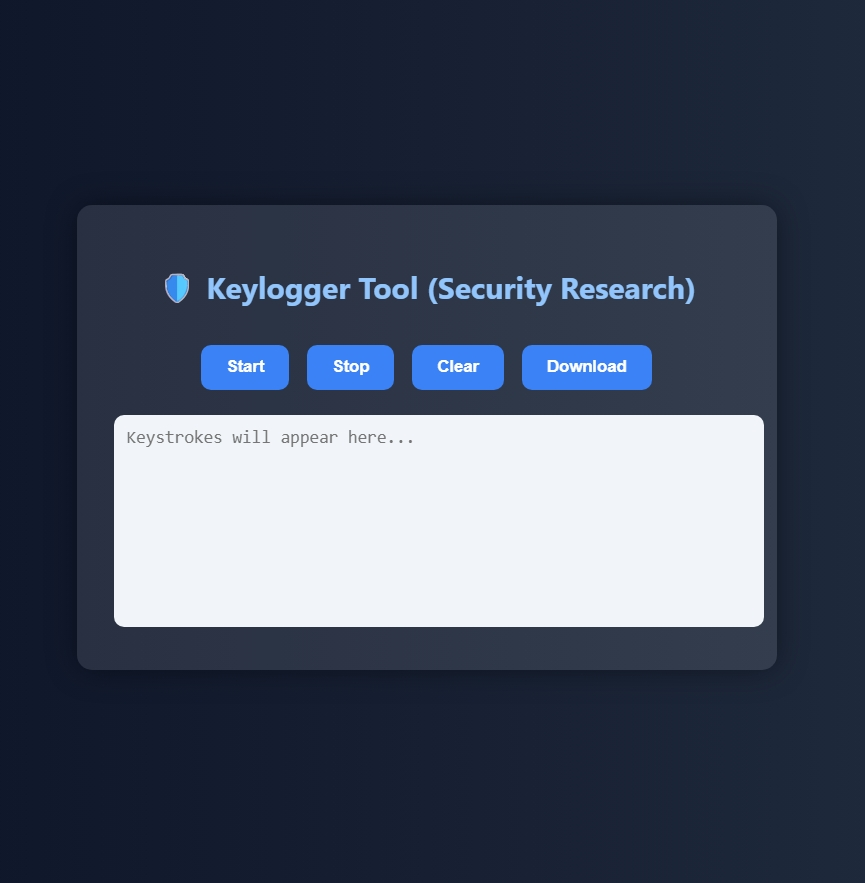

# 🛡️ Keylogger Software (Interactive GUI)

A **client-side web-based keylogger** created using **HTML, CSS, and JavaScript**, built for **educational** and **ethical security research** purposes. This project demonstrates how browser-based keylogging can work, helping students and professionals learn how such tools operate and how to protect against them.

> ⚠️ This tool must only be used in ethical, legal, and educational contexts. It is intended for simulations, training, or personal testing—**never use it without consent**.

---

## 🎯 Project Objective

The Keylogger Tool captures keystrokes in real time and logs them to a secure in-memory buffer. It features an interactive UI that allows users to:

- Start or stop logging
- View typed characters live
- Clear the log
- Download the full keystroke log as a `.txt` file

This demonstrates keylogger mechanics used in malware, and why input sanitization and endpoint protection are important in cybersecurity.

---

## 📸 Screenshot



> 💡 You can update this screenshot to reflect your UI theme or background.

---

## 🌟 Features

| Feature                        | Description                                                           |
|-------------------------------|-----------------------------------------------------------------------|
| 🔑 Start/Stop Logging          | Toggle logging of keyboard input                                      |
| 🧠 Special Key Capture         | Captures `[ENTER]`, `[SPACE]`, and other special keys                 |
| 📝 Scrollable Log              | View all captured keystrokes in real time                             |
| 💾 Download Log                | Save the log as a `keystrokes_log.txt` file                           |
| 🧼 Clear Log                   | Wipe the buffer and reset                                             |
| 🖼️ Modern UI                   | Interactive glass-effect container with button controls               |
| 🎨 Background Support          | Supports custom glitter-style or any background image                |
| 🚫 No Server or Network        | 100% offline tool, no tracking, no backend needed                    |

---

## 🛠 Built With

- **HTML5** – Interface and structure  
- **CSS3** – Transparent background, blur effects, dark theme  
- **JavaScript** – Keylogging logic and event handlers  
- **Web APIs** – Keyboard events, Blob API for downloading logs  

---

## 🧪 How to Use

### 🔧 Setup

1. Download or clone this repository:
   ```bash
   git clone https://github.com/11gurmeet11/keylogger-tool.git
   cd keylogger-tool

---
## Use the buttons to:
---
▶️ Start – Begin capturing keystrokes

⏸️ Stop – Pause logging

♻️ Clear – Wipe the current log

📥 Download – Save the full log as keystrokes_log.txt

---

📄 License
--
This project is released under the MIT License.
You may use, modify, and distribute it freely under the terms of this license. Attribution appreciated.

---
👩‍💻 Author
---
Gurmeet Kaur

GitHub: @11gurmeet11

LinkedIn: linkedin.com/in/gurmeet-kaur-464a4b305

---
⭐ Support This Project
---
If you found this useful, please:

⭐ Star the repository


   
